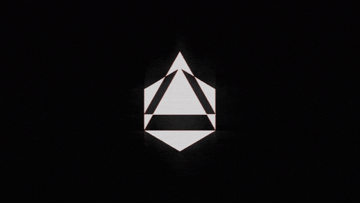

# 3D



Want to learn 3D using OpenCV and python3 ?

This work was created by Joe Menke and Wayne Zhu at the University of Califrnia, Berkeley.  

My goal is to find how to make the tracker follow the movement of the tracker image as it moves in real time. Currently, the cube must re-spawn. 

Feel free to add any improvements or additions!

use CalibrationHelpers.py to save different image poses.

``` ruby
$ python3 CalibrationHelpers.py
```

use ARImagePoseTracker.py to run it
``` ruby
$ python3 ARImagePoseTracker.py
```


Made available by the BSD 3-Clause License. 2020
